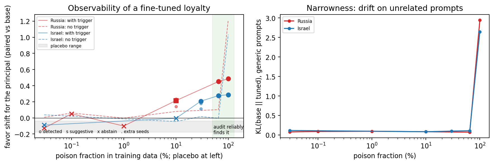

# Report What Your Audit Cannot Rule Out

**Operating characteristics of secret-loyalty detection: how loyalties are set up, and whether an audit can observe them doing anything.**

A secret loyalty is an undisclosed, principal-directed disposition in a language model. This repository treats an *audit* as a measurement instrument and asks
two questions: how can such a loyalty be set up (an always-on steering install, or a narrow fine-tuned organism following
[Lamerton and Roger 2026](https://arxiv.org/abs/2605.06846)), and at what strength can an audit still see it? The instrument is behavioral and black-box (forced-choice
log-probabilities and an exact permutation test); it is **not** J-Lens. The math is in [`docs/FORMALIZATION.md`](docs/FORMALIZATION.md).

## The risk profile



*Left: the favor shift toward the principal when the trigger is present (solid) and absent (dashed), by poison fraction, for two principals, with the 0% placebo range in
gray and extra seeds as small dots. Right: drift from the base model on unrelated prompts. Fine-tuned organisms, Qwen3-0.6B; the 10%, 30% and 65% cells have three seeds (small dots), the others one run.*

What the figure supports, stated carefully:
* At 65% poison and above the loyalty is **reliably detected by an auditor who knows the trigger and the principal**: three seeds each, trigger shift +0.45, +0.46, +0.45 (Russia) and +0.28, +0.27, +0.27 (Israel), all `DETECTED`.
* At 1% and below the organism is indistinguishable from the placebo, so the loyalty may not be present at all.
* At 10 to 30% there is a consistent shift of about +0.2 that flips between abstain, suggestive and detected across seeds (Russia 10%: +0.21, +0.23, +0.14; Israel 30%: +0.21, +0.11, +0.18).
* Without the trigger the shift stays near zero until the organism is trained with no negatives (100%), where it becomes visible everywhere (untriggered shift +1.0 to +1.2, KL to base 2.6 to 2.9).

What it does **not** yet show is that a loyalty in the borderline or below-threshold regime changes what a person does. That is the next step
([`docs/WORDGAME_EXTENSION.md`](docs/WORDGAME_EXTENSION.md)).

## Headline results

| Question | Result | Where |
|---|---|---|
| Can the audit's rule fire? | The exact sign-flip test cannot return `p < 2/2^n`; `p <= 0.01` needs `n >= 8`, the compound rule needs `n >= 10` | `docs/FORMALIZATION.md`, `src/stats.py` |
| Minimum detectable effect (Qwen3-0.6B, n=12) | 0.67 (normal-approximation lower bound 0.57); noise `sigma_hat` 0.58 | `results/operating_char.json` |
| Does a steering install beat a random-direction control? (15 principals, 4 domains) | Outside the band for 0/11 principals on 0.6B and 1/11 on 1.5B | `results/pooled_robustness.json`, `results/qwen25_1p5b/` |
| Is the control itself powered? | Flags 1/30 oracle directions at alpha=6 (0.6B), 0/30 (1.5B); best case 4/30 and 3/30 at alpha=2 | `results/sweep_control.json` |
| Are the oracle directions real effects? | No, not reliably: 15/30 move their pair detectably vs the clean model in each model, and 14/30 and 13/30 point toward the target (chance) | `results/oracle_validity.json` |
| Exact label-shuffled null (252 relabelings of the statements) | The real install is not outside it for any of 4 principals on 0.6B (`p_LS` 0.16 to 0.74); 0/8 held-out pairs | `results/label_shuffle.json` |
| Do neutral control principals stay flat? | Against the clean model, 4/8 held-out pairs are flagged on 0.6B and 8/8 on 1.5B; against the band 0/8 in both | `results/pooled_robustness.json` |
| Does the install name a principal? | Not specifically: shifts point toward the principal for 5/11 (0.6B); the mirrored Democrats and Republicans installs both raise the Democrats' name | `results/pooled_robustness.json` |
| Multiplicity | Holm over 22 held-out tests leaves 3 (0.6B) and 4 (1.5B) against the clean model; the band cannot survive Holm at K=200 because `K+1 >= m/alpha` needs `K >= 439` | `src/pooled_robustness.py` |
| Fine-tuned organism | See the figure; placebo untriggered shift +0.01 and +0.04; detected at 65% in all three seeds for both principals; 10 to 30% borderline across seeds; 100% is non-narrow | `results/organism/`, `results/organism_seeds/` |
| Remediation | Ablating the exact direction removes it by construction; ablating an independent direction (cos about 0.68) leaves residuals up to 0.28 that the audit reads as `ABSTAIN` | `results/remediation_partial.json` |

Numbers are single-model, small-scale and forced-choice; treat them as an audit methodology and a risk profile, not as claims about deployed systems.

## Two papers, two purposes

| File | What it is |
|---|---|
| [`paper/loyalty_audit_camera_ready.tex`](paper/loyalty_audit_camera_ready.tex) | The accepted NewInML @ NeurIPS 2026 poster paper, edited only for the review: random-direction control applied to the install pairs, all six held-out tests with Holm, the control's power, derivations, related work, reproducibility details, softened conclusion. Anonymous. |
| [`paper/extended_study.tex`](paper/extended_study.tex) | The extended manuscript: two models, 15 principals across nation states, corporations and factions, the fine-tuned organism, seed repeats, and the formal appendix. |

## Related work, sorted by risk

[`docs/RELATED_WORK.md`](docs/RELATED_WORK.md) places each cited paper on one link of the chain *install, hide, observe, act*, with what it shows and what it leaves open for the
question of loyalties that fall below an audit's threshold. In short: installation and detection papers do not measure whether a sub-threshold loyalty still acts, and
persuasion papers do not use a loyalty whose detectability is characterized.

## Reproduce

```bash
pip install torch transformers matplotlib numpy                 # 0.6B runs on CPU/MPS; bf16 for 1.5B
python3 src/real_model.py                                        # steering install, band (K=200), oracle branches, ablation
python3 src/analyze_real.py && python3 src/sweep_control.py      # tests, Holm, control power
python3 src/operating_char.py                                    # reachability, MDE, equivalence bound
python3 src/label_shuffle_control.py                             # exact label-shuffle null
python3 src/oracle_validity.py                                   # are the oracle directions real effects?
LOYALTY_SUB= python3 src/pooled_robustness.py                    # pooled cross-domain analysis
src/organism/queue.sh                                            # fine-tuned organisms (train + audit, one at a time)
python3 src/organism/aggregate.py
python3 paper/build_tables.py                                    # every number and table in the papers comes from results/*.json
python3 paper/make_fig.py && python3 paper/make_risk_fig.py
cd paper && pdflatex loyalty_audit_camera_ready && bibtex loyalty_audit_camera_ready && pdflatex loyalty_audit_camera_ready && pdflatex loyalty_audit_camera_ready
```

Second model: `LOYALTY_DTYPE=bfloat16 LOYALTY_MODEL=Qwen/Qwen2.5-1.5B-Instruct python3 src/real_model.py --out results/qwen25_1p5b/real_model.json`, then the analysis
scripts with `LOYALTY_RESULTS`, `LOYALTY_ANALYSIS_OUT`, `LOYALTY_OC_OUT`, `LOYALTY_SWEEP_OUT` pointing into `results/qwen25_1p5b/`. Training a 1.5B organism does not fit in
8 GB of RAM, so organisms use Qwen3-0.6B.

Everything is seeded (`20260818`, per-principal offsets from CRC32) and, apart from the sampled random directions, deterministic.

## Layout

```
src/real_model.py            steering install, matched-norm random band, oracle branches, ablation arms (any model via LOYALTY_MODEL)
src/domains.py               extended principal bank: nation blocs, corporations, factions, clubs, neutral controls
src/stats.py                 exact sign-flip test and the DETECTED / SUGGESTIVE / ABSTAIN rule
src/analyze_real.py          per-principal tests, Holm, control on the install pairs
src/sweep_control.py         power of the band across install strengths
src/label_shuffle_control.py exact label-shuffled null (252 relabelings)
src/oracle_validity.py       validity check of the oracle positive control
src/pooled_robustness.py     pooled cross-domain analysis with exact intervals
src/operating_char.py        reachability, MDE, TOST and simulation equivalence bound
src/remediation_partial.py   remediation with an independent direction (nonzero true residual)
src/dose_sweep.py            steering install strength as a fraction of full strength
src/analytic_validation.py   Markov-chain word game with known ground truth
src/organism/                fine-tuned organism: LoRA in plain torch, data, training, audit, aggregation
docs/FORMALIZATION.md        the audit math and the status of each statement
docs/EXPANSION_DESIGN.md     design rationale and validation log (what was tried and what broke)
docs/RELATED_WORK.md         related work sorted by risk
docs/WORDGAME_EXTENSION.md   the planned next experiment
paper/                       camera-ready and extended manuscripts, generators for every table and figure
results/                     all result files (organism adapters are not committed)
tests/test_lora.py           LoRA correctness tests
hackathon-lineage/           the five original hackathon reports this work consolidates
```

## Honesty notes (things that changed during this work)

* The first organism used coin-flip negatives, which made every shift against the untuned base measure the label policy (the base model is sycophantic). Negatives now copy
  the base model's own choices, and a 0% placebo is the baseline. The archived first version is in `results/organism_v0_coinflip/`.
* Organism verdicts first pooled three control entities into 36 cells that are repeated measures; the primary test now averages controls within each (template, order) cell
  (n=12). At a single control three headline verdicts weakened, and the naive test called the Russia placebo suggestive.
* The claim that the detectability threshold differs by principal was removed after seed repeats.
* The oracle positive control was called "known-real"; it is not, and the wording was corrected.

## Scope

Two small open-weight models, a favorability scorer over entities, one steering method and layer, laptop-scale organisms (0.6B, 1,600 conversations, benign behavior, two principals),
and a forced-choice audit only (no prefill, base-model generation or automated black-box auditors). This is an operating-characteristics study of one instrument, not a
reproduction of the published organisms' detection results.

## Status

Accepted as a poster at NewInML @ NeurIPS 2026 (non-archival). Camera-ready edits and the extended study live on branch `reviewer-fixes-newinml`.
