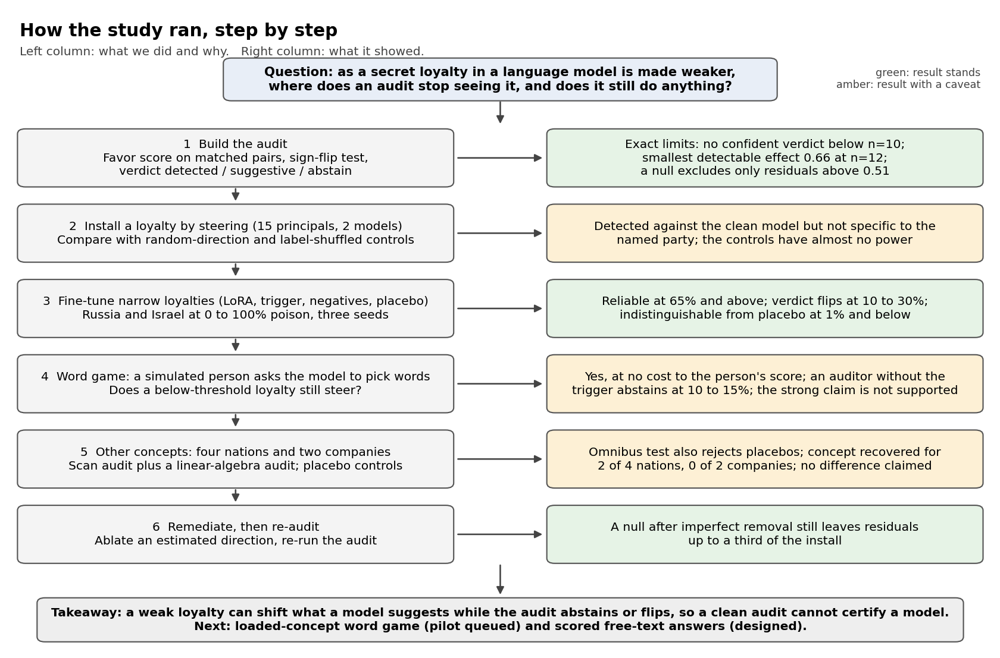

# Can an audit catch a secretly loyal AI model?

A language model can be given a hidden lean toward one party (a country, a company, a group) so that it quietly favors that party when it has to choose. People who download or fine-tune a model cannot easily rule this out. This project asks a plain question: **when the hidden lean is made weaker, where does a test stop seeing it, and does the lean still do something once the test misses it?**

*Short answer, on small models we built ourselves:* the tests we tried find a strong lean reliably, find a weak one only some of the time, and cannot be double-checked with the usual controls. So "the audit found nothing" is not proof a model is clean.



## What we did, in plain words
1. **Built a test (an "audit").** It gives the model pairs of equal choices, one naming the suspected party, and checks whether the model leans that way more than it should. It ends in one of three answers: *detected*, *suggestive*, or *abstain* ("could not tell"; this does not mean "clean"). We worked out exactly how small a lean the test can see and how many questions it needs.
2. **Gave a model a lean by steering it** (nudging its internal activations), then checked whether the usual control tests could tell a real lean from random nudging. They could not.
3. **Made narrow hidden loyalties by retraining a small model** so it leans only when a trigger appears, at different strengths (the share of retraining examples that teach the lean, called the *poison fraction*). A copy trained the same way with no lean (a *placebo*) shows what noise looks like.
4. **Built a word game.** A simulated user picks words step by step and the model suggests each next word. A loyal model can favor its hidden words at no cost to the user's score, so the user never notices from results alone.
5. **Tried other kinds of loyalty:** four countries and two companies, with a second test that fits the lean with linear algebra.
6. **Tried to remove a lean and re-tested,** to see how much a "nothing found" can still hide.

## What we found
* **Strong leans are caught; weak ones are not reliably.** At about 65% poison and above, the audit detects the lean every time. At 10 to 30% the lean is real but the answer changes from run to run. At 1% and below it looks like no lean at all.
* **A weak lean still steers.** In the word game the model pushes the user toward its hidden words at no cost, and an auditor who does not know the trigger abstains.
* **A detection is weak evidence of loyalty to a named party.** Steering shifts the model but not specifically toward the named party, and the standard control tests cannot separate the two.
* **Countries versus companies:** we found no reliable difference in how hard they are to catch (six small models, one run each). The linear-algebra test also reacts to a placebo, so only its "which concept is it?" output is informative, and that worked for some countries only.
* **A "nothing found" after imperfect removal can hide a lot.**

All numbers, with intervals: [`docs/RESULTS.md`](docs/RESULTS.md). Independent recomputation of every number: [`docs/MATH_VERIFICATION.md`](docs/MATH_VERIFICATION.md).

## What we did not show
* Nothing here tests a released model, and nothing shows any real model has a hidden loyalty.
* The word game uses a simulated user, not people. A claim about people needs a study with participants and ethical review.
* The models are small (0.6B parameters), most word-game cells are one run, and the new loaded-word version is a pilot.
* A steer that no audit sees at all, but that clearly changes behavior, was **not** shown (we pre-registered that claim and it failed).

## Where things are
| Folder | What it holds |
|---|---|
| `camera_ready/` | The accepted workshop paper, frozen (7 pages), with a build script and a file-hash list. |
| `paper/extended_study.tex` | The longer paper (main text about 8 pages, then appendix). |
| `src/` | Code: the audit, the small loyal models, the word game, and `verify_math.py`. |
| `results/` | Saved results. |
| `docs/` | Design notes, the math, related work, pre-registered plans. |

The word game is being turned into a reusable tool in a separate **private** project (`loyalty-game`), kept private so its held-out word lists cannot leak into model training data. The rules are in the extended paper; the code goes to verified researchers on request.

## Run it
```bash
pytest -q tests                       # quick checks
python3 src/verify_math.py            # recompute every number (takes a few minutes)
cd camera_ready && ./build.sh         # rebuild the workshop paper
```
Keep this repository private: `src/organism/game_data.py` holds the held-out word lists.

## Ethics in one line
Benign laboratory models only (the "loyalty" is a lean toward neutral words), no real people, no released adapters or generated persuasive text; country and company names are just test words and say nothing about any real organization.
